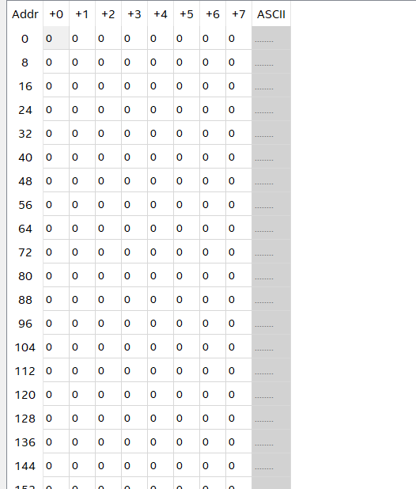

# 数电实验报告


---

## 实验十二				复刻打字游戏


​												**计算机科学与技术系     **


​												**181860055 		[刘国涛](https://github.com/youngstudent2)**  

​												**181860044		 [李翰](https://github.com/Eternity-AIBN)** 


​									

​				**项目地址：**[Github](https://github.com/Digital-circuits-team/Final-DC-exp)


​									

​		


**2019年12月22日**					


------


## 目录


[TOC]


---


### 1.实验目的

本次实验为自选大实验，主要目的是在一个较大的项目综合运用本学期所学内容，加深对知识的理解，并在一定程度上锻炼对一个大项目的分析、拆解及整合能力。

复刻打字小游戏：使用FPGA实现计算机系统基础课PA4的打字小游戏，即屏幕上随机产生一些字母，并以不同随机速度掉落。玩家需要按对应的键在字符掉落到屏幕底部之前消除字符。

**基本功能：**

- 只需实现界面中的字符部分。VGA采用60Hz刷新率，分辨率和字符大小可与PA4不同
- 实现随机字符产生，字符掉落，按键消除字符功能和游戏逻辑
- 游戏信息提示，“FPS”等字符，色彩可以自选

> 思考：
>
> - 如何实现字符的“平滑”下落
> - 用FPGA实现与用NEMU实现有什么相同的地方，有什么地方不同

### 2.知识背景

此次实验（打字游戏）涉及的知识背景主要是VGA字符显示（主要对应于实验9，实验11）、程序与键盘的交互（主要对应于实验8）、以及伪随机序列发生器（实验6）


### 3.实验环境/器材等

环境：Quartus 17.1 Lite，Windows 10

器材：DE10 Standard开发平台

### 4.组内分工


---

<center>李翰同学</center>
---

- 工作量>30小时
- 完成对字符显示、字符存储、字符下滑、键盘消除等功能的代码实现
- 实现顶层模块，完成对VGA显示模块、键盘模块的综合
- 实现速度RAM、字符RAM


---

<center>刘国涛同学</center>
---

- 工作量>30小时
- 设计游戏架构，设计模块间逻辑、数据结构、以及字符下滑的实现逻辑
- 完成对`Generator`、FPS和分数的显示、界面状态机的代码编写
- 完成对界面的设计和界面ROM的实现
- 对最终项目的测试和整理发布


### 5.设计思路、流程图

为了实现目标功能，在前期提出以下问题：

>- 如何生成字符
>    - 需要生成那些信息
>    - 生成后的信息如何存储
>    - 如何实现随机生成
>- 如何实现字符的平滑下落
>    - 采用什么样的显存
>    - 如何实现字符的下落
>    - 如何实现字符的平滑下落
>    - 如何针对不同速度的字符实现平滑下落
>- 如何通过键盘删除对应字符
>    - 如何快速地找到显存中对应的字符
>    - 通过什么方式删除
>- FPS和分数如何计算并显示
>
>

##### 1.阶段划分

根据提出的问题，我们将实验划分为以下四个阶段：

 ```mermaid
graph LR
 	p1(随机产生字符)
 	p2(字符平滑下落)
 	p3(键盘消除字符)
 	p4(实现FPS和分数的显示)
 	p5("实现界面状态机(附加功能)")
 	p1-->p2
 	p2-->p3
 	p3-->p4
 	p4-->p5
 ```

##### 2.数据结构

**`Generator`产生的字符信息：**

一个字符表项共30位，各位区段对应含义如下

| [29:22] | [21:19] | [18:10] | [9:0] |
| :-----: | :-----: | :-----: | :---: |
|   ch    |  speed  |    x    |   y   |

**用于存储生成的字符、实现字符下滑、实现键盘消除的结构：**

```c++
typedef struct{
    bool ex;//使用寄存器实现，标志该列是否存在字符
    char ch;//使用RAM实现，记录对应列存在的字符ASCII码
    int offset;//使用寄存器实现，记录当前列的行偏移
    int speed;//使用RAM实现，记录当前列存在的字符的速度
}ColumnInfo;

typedef struct{
	ColumnInfo col[640];    
}ColumnTable;
```


##### 3.各阶段思路

###### 随机产生字符

通过`Generator`模块随机生成如下字符信息： <span style='color:purple;background:white;font-size:16;font-family:字体;'>字符对应的ASCII码、速度及横纵坐标</span> 

`Generator`通过调用LSFR实现的随机序列发生器模块`random`，为四个属性生成以下范围的随机数：

|  属性  | 随机数范围 |
| :----: | :--------: |
| ASCII  |  ‘A’-‘Z’   |
| speed  |   (1,3)    |
| 列坐标 |  [0,640)   |
| 行坐标 |   恒为0    |

###### 字符平滑下落

在具体设计中采用一个由 ```640个8bit reg型变量```组成的数组 <span style='color:purple;background:white;font-size:16;font-family:字体;'>offset</span> 来储存某一个字符的坐标（如offset[a]则表示横坐标为a的字符的纵坐标是多少，此处约定不会有两个字符的横坐标相同）。同时相应的用另一个由 ```640个3bit reg型变量```组成的数组 <span style='color:purple;background:white;font-size:16;font-family:字体;'>speed</span> 来储存某一个字符的速度(约定速度范围是 <span style='color:blue;background:white;font-size:16;font-family:字体;'>1~7</span> )，如此即可通过 <span style='color:purple;background:white;font-size:16;font-family:字体;'>offset[a]=offset[a]+speed[a]</span> 更新某一字符的纵坐标以实现字符下滑效果。

###### 键盘消除字符

当键盘按下按键时，在屏幕上找到相应字符，可以通过如下设置：

```verilog
offset[a]=8'd520;
speed[a]=3'd0;
```

即将字符纵坐标设为一个大于显示器高度的值，同时速度设为 0 ，如此字符便不会在屏幕上出现，同时也不会由于一直加上 <span style='color:purple;background:white;font-size:16;font-family:字体;'>speed[a]</span> 而导致 <span style='color:purple;background:white;font-size:16;font-family:字体;'>offset[a]</span> 溢出变为0而重新出现在屏幕中。当该位置产生新的字符时，只需根据`Generator`模块提供的信息设置即可。


##### 4.模块化设计

此次实验主要分为`8`个模块，分别是**通用时钟生成模块clkgen**，**VGA控制器模块**，**键盘控制器模块FSM**，**字符字模点阵Lattice_ROM模块**，**字符显存ascii_ram模块**，**字符速度显存asc_speed模块**，**随机数生成Generator模块**，以及**顶层实体Game模块**。

上述模块之间的组织和联系大致如下：


##### 5.相关变量

此次实验中除了时钟信号、与 VGA 和键盘相关的一些输入输出变量之外，在顶层实体中对于每个模块以及几个always块还需另外定义一些变量，大致如下：

对于```Generator```模块，需要给其提供一个时钟信号，以及几个wire型变量用于接收随机生成的信息，相关变量定义如下：

```verilog
wire generator_clk;  //随机生成字符的时钟信号
wire [7:0]char;  //字符ASCII码
wire [2:0]tmp_speed;  //速度
wire [8:0]tmp_x;  //横坐标 
wire [9:0]tmp_y;  //纵坐标
```

对于```Lattice_ROM```模块，需要定义一个 12bits 的wire型变量用于表示读取地址，以及一个 12bits 的wire型变量用于储存从点阵ROM中读取到的 9bits 信息，相关变量定义如下：

```verilog
wire [11:0] rom_outaddr; //读取点阵ROM中该地址
wire [11:0] color_bit; //从点阵ROM中读取到的9bit信息
```

对于```vga_ctrl```模块，需要定义一个 24bits 的reg型变量用于表示上层提供的vga_data，以及两个 10bits 的wire型变量用于表示当前扫描点的横纵坐标，相关变量定义如下：

```verilog
reg [23:0] vga_data;
wire [9:0] h_addr;
wire [9:0] v_addr;
```

对于```asc_ram```模块，需要定义两个 10bits 的wire型变量分别表示显存的写入和读出地址，以及一个8bits的wire型变量用于表示从字符显存中读取到的ASCII码，此外，由于读取到的ASCII码在后续操作中需要进行左移运算，为防止其发生溢出，需额外定义一个12bits的变量来储存左移结果，相关变量定义如下：

```verilog
wire [9:0] inaddr;  //写入字符显存中的地址
wire [9:0] outaddr;  //读取字符显存中该地址
wire [7:0] get_asc; //从字符显存中读取到的ASCII码（8位）
wire [11:0] get_asc_12bit;
```

对于FPS和分数显示模块，需要一个8bit的reg型变量存储分数，以及两个8bit的reg型变量完成对帧率的计数和显示

```verilog
reg [7:0] score;//分数
reg [7:0] fps,fps_reg;//帧率
```

```FSM```模块则需要定义一个8bits的变量用于表示键盘按键对应的ASCII码，定义如下：

```verilog
wire [7:0] press;
```

除此之外，还需要一些其他的变量，分别如下：

```verilog
reg flag;  //辅组判断当前扫描点所获取到的1bit信息是否有效
reg [9:0] offset[639:0]; //行偏移量
wire [2:0] speed;  //速度
wire [2:0] wirte_speed;  
reg [2:0] reg_speed; 
reg [9:0] h_offset;  //字符内列信息，防止溢出故设为10位
reg [3:0] v_offset;  //字符内行信息
reg [639:0] columnTable;  //判断某一列是否有字符
reg [9:0] charIndex;  //当前字符索引
reg [18:0] countclk;  //用于计数,辅组产生字符下滑信号
reg [5:0] count;   //用于计数,辅组产生字符下滑信号
reg moveable;  //字符下滑信号,每隔一定周期让字符下滑
	
reg gameover; //游戏结束标志
	
reg remove_flag;  //字符消除标志

reg [7:0] score;//分数
reg [7:0] fps,fps_reg;//帧率

//state contrl
wire [19:0] addr;
wire [2:0] wel_data;
wire [2:0] end_data;
reg clk_en;
reg pressing;
```

对于`state control`模块的变量，addr用于在图片ROM中寻址，从中取出的RGB数据分别存入`wel_data`和`end_data`中。`clk_en`是`generator_clk`时钟使能，在非游戏状态下置为0，确保无字符产生。`pressing`用于状态切换时的控制单次回车只切换一个状态，具体可见[此处](#界面状态机设计)

### 6.实验步骤/过程

##### 1.用IP核生成字符显存RAM

生成mif文件(初始化为全0)：




生成双口RAM:


##### 2.用IP核生成速度显存RAM

生成mif文件(初始化为全0)：


生成双口RAM:


##### 3.设计字模点阵ROM:


##### 4.导入通用时钟生成模块，VGA控制模块


##### 5.设计随机生成模块

`Generator`调用LSFR实现的八位和十二位随机数生成器生成随机数，`Generator`模块实现如下：

```verilog
module Generator(clk,ch,speed,x,y);
     input clk;
	 output [7:0] ch;
     output [2:0] speed;
	 output [8:0] x;
     output [9:0] y;
	
	 wire [11:0] ran_y;
	 wire [7:0] ran_ch;
	 wire [7:0] ran_speed;
	 
	 wire fake;
	 
    random8 #(2) random_speed(
        .clk(clk),
        .randomNum(ran_speed)
    );

    random12 #(315) random_y(
        .clk(clk),
        .randomNum(ran_y)
    );
	 
	random8 #(9) random_ch(
		.clk(clk),
		.randomNum(ran_ch)
	);
	
	//生成属性值
    assign y = 11'hA+(ran_y&11'h3f)*9;
	assign x = 9'd0;
	assign ch = 8'd65 + ran_ch%26;
	assign speed = ran_speed%2 + 1;
endmodule 
```

随机数生成器（八位）实现如下：

```verilog
module random8(clk,randomNum);
    input clk;
    output reg [7:0] randomNum;
    reg lin;
	 parameter seed = 8'd0;
	 initial begin
			randomNum=seed;
	 end
    always @ (posedge clk) begin
			if(randomNum==8'd0)
              randomNum=8'hff;
         else begin
              lin = randomNum[4]^randomNum[3]^randomNum[2]^randomNum[0];
              randomNum = {lin,randomNum[7:1]};
				  
              if(randomNum==8'hff)
                  randomNum = 8'd0;
              else
                  randomNum = randomNum;
         end        
    end

endmodule 
```

##### 6.初步设计顶层实体Game模块

###### 首先进行一些模块的实例化:

```verilog
//生成vga_clk
clkgen #(25000000) my_vgaclk(
	.clkin(CLOCK_50), 
	.rst(1'b0), 
	.clken(1'b1), 
	.clkout(VGA_CLK) 
);
	
//用于随机生成字符的时钟
clkgen #(1) my_generator_clk(
	.clkin(CLOCK_50), 
	.rst(1'b0), 
	.clken(clk_en), 
	.clkout(generator_clk) 
);
	//随机生成字符
Generator gen(.clk(generator_clk),.ch(char),.speed(tmp_speed),.x(tmp_x),.y(tmp_y));


	//点阵ROM，取出字模信息color_bit
Lattice_ROM lat_rom(.clk(CLOCK_50), .outaddr(rom_outaddr), .dout(color_bit)); 
	

ascii_ram ram(  //字符显存，写入char/读出get_asc
	.data(char),
	.rdaddress(outaddr),
	.rdclock(VGA_CLK),
	.wraddress(inaddr),
	.wrclock(generator_clk),
	.wren(1'b1),
	.q(get_asc)
); 
	
asc_speed sp(  //speed显存，写入wirte_speed/读出speed
	.clock(VGA_CLK),
	.data(wirte_speed),
	.rdaddress(outaddr),
	.wraddress(inaddr),
	.wren(generator_clk),
    .q(speed)
);
assign wirte_speed=reg_speed;

vga_ctrl my_vga_ctrl( 
	.pclk(VGA_CLK), //25MHz时钟 
	.reset(SW[1]), //置位 
	.vga_data(vga_data), //上层模块提供的VGA颜色数据 
	.h_addr(h_addr), //提供给上层模块的当前扫描像素点坐标 
	.v_addr(v_addr), 
	.hsync(VGA_HS), //行同步和列同步信号 
	.vsync(VGA_VS), 
	.valid(VGA_BLANK_N), //消隐信号 
	.vga_r(VGA_R), //红绿蓝颜色信号 
	.vga_g(VGA_G), 
	.vga_b(VGA_B) 
); 
assign VGA_SYNC_N = 0;
```

###### 然后设计多个always块实现主体功能:

首先需要一个always块来产生字符下滑信号，即让屏幕上的字符每隔一定周期下滑，本次实验中仿造clkgen模块的设计，通过对一个固定周期变化的变量进行计数来生成所需信号，大致设计如下：

```verilog
always @ (posedge VGA_CLK) begin 
	countclk=countclk+1'b1;
	if(countclk==19'd420000)begin
		count=count+6'd1;
		countclk=19'd0;
	end
	if(count==6'd1)begin
		count=6'd0;
		moveable=1'b1;
	end
	else if(countclk==19'd830)begin
		moveable=1'b0;
	end
end
```

然后需要两个always块分别获取当前扫描处对应字符的字符内列信息和行信息，设计如下:

```verilog
always @ (posedge VGA_CLK) begin   //获取字符内列信息
	if(columnTable[h_addr] == 1'b1) begin  //当前扫描处有新的字符
		charIndex=h_addr;   //将字符索引改为当前扫描处
		h_offset=10'd0;     //初次扫描到该字符,将字符内行信息置为0
	end
	else begin
		charIndex=charIndex;   
		h_offset=h_offset+10'd1;  //将字符内行信息依次增加
	end
end
	
always @ (posedge VGA_CLK) begin   //获取字符内行信息
	if(v_addr>=offset[charIndex]&&offset[charIndex]+4'd15>=v_addr) begin 
        //当前扫描处有字符,则字符内列信息计算如下,并将flag标志置1
		v_offset<=(v_addr-offset[charIndex])&10'b0000001111;
		flag<=1'b1;
	end
	else begin	//当前扫描处没有字符,则将flag标志置0
		v_offset<=4'b0;
		flag<=1'b0;
	end
end
```

接着需要用一个always块来处理字符的产生及下滑:

字符产生：

```verilog
if(generator_clk)begin  //生成字符，设置offset和speed
	offset[tmp_y][8:0]<=tmp_x;
	reg_speed<=tmp_speed;
	columnTable[tmp_y]<=1'b1;
end
else begin end
```

字符下滑及消除(由于尚未加入键盘模块，暂时约定字符下滑到屏幕底部自动消除):

```verilog
if(moveable==1'b1&&h_offset==10'd0&&v_addr==10'd0)begin  
	offset[charIndex]<=offset[charIndex]+speed;
    if(offset[charIndex]>=lower_bound) begin
		//临时擦除字符试验
		speed[charIndex]<=3'd0;
		reg_speed<=3'd0;
		offset[charIndex]<=10'd520;
		columnTable[charIndex]<=1'b0;	
	end
end
else begin offset[charIndex]<=offset[charIndex]; end
```

至此将sof文件烧写到开发板上之后，字符已经可以随机产生并且平滑下落，到达屏幕底部之后自动消失且不再出现．

##### 7.导入已设计好的键盘控制器模块，并稍加修改


##### 8.加入键盘消除字符功能

对之前设计的字符产生及下滑模块加以修改，具体修改"临时擦除字符试验"部分，设计如下:

```verilog
if(remove_flag==1'b1&&get_asc==press)begin  //字符消除
		reg_speed<=3'd0;
		offset[charIndex]<=10'd520;
		columnTable[charIndex]<=1'b0;
		remove_flag<=1'b0;
end
else if(moveable==1'b1&&h_offset==10'd0&&v_addr==10'd0)begin  //该字符没有被消除，继续字符下滑
		offset[charIndex]<=offset[charIndex]+speed;
		if(press==8'h31)begin remove_flag<=1'b1; end  //松开按键，准备消除下一个字符
end
else begin offset[charIndex]<=offset[charIndex]; end
```

至此基本功能已经实现完毕.

##### 9.计分

初步实现：字符下滑模块中消除字符分支进行计分

```verilog
if(remove_flag==1'b1&&get_asc==press)begin  //字符消除
			reg_speed<=3'd0;
			offset[charIndex]<=10'd520;
			columnTable[charIndex]<=1'b0;
			remove_flag<=1'b0;
			//计分
			score <= score + 8'd1;
end
```

改进：在后面实现界面切换功能时，需要在重新进入游戏状态时将score清零，所以需要将计分移至状态机的实现当中，根据`remove_flag`判断分数是否增加

```verilog
always @ (posedge CLOCK_50) begin //状态转换
    case(state)
			WEL_STATE:
			PLAY_STATE:begin
				
				if(remove_flag==1'b0)begin //解决由于时序导致的积分问题
					if(score_flag==1'b1) 
						score_flag<=1'b1;
					else begin	
                        //计分
						score<=score+8'd1;
						score_flag<=1'b1;
					end
				end
				else
					score_flag<=1'b0;
				
				
                if(gameover) begin //转移至结束状态
					clk_en<=1'b0;
					pressing<=1'b1;
					state <= END_STATE;
				end			
			end
			END_STATE:


		endcase
	end
```

值得注意的是，这里由于状态切换和`remove_flag`设置采用的时钟不同，为了保证在一个`VGA_CLK`周期内，分数只增加一次，采用了如下结构：

```verilog
if(remove_flag==1'b0)begin 
	if(score_flag==1'b1) 
        score_flag<=1'b1;
    else begin	
        //计分
		score<=score+8'd1;
		score_flag<=1'b1;
	end
end
else
	score_flag<=1'b0;
```

该结构保证了在一次`remove_flag`为1的周期里分数只被计算一次

##### 10.FPS计数

VGA_CLK每525*800=420000个周期扫描过一帧，因此通过时钟`VGA_CLK`进行驱动fps计数，另生成一一秒的时钟`fpsclk`进行显示驱动

```verilog
	clkgen #(1) fps_clk(CLOCK_50,1'b0,1'b1,fpsclk);
	
	always @ (posedge fpsclk) 
		fps_reg=fps<<1;
```

##### 11.FPS和分数显示

计算字模点阵中的地址

```verilog
	assign fps_ten = 8'h30+fps_reg/10;
	assign fps_one = 8'h30+fps_reg%10;
	
	assign score_ten = 8'h30+score/10;
	assign score_one = 8'h30+score%10;
	
	
	always @ (posedge VGA_CLK) begin  //分数和帧率显示的地址处理
		
		if(v_addr>=10'd0&&v_addr<10'd16) begin //output fps
			if(h_addr>=10'd620&&h_addr<10'd629) begin //十位
				sp_addr <= (fps_ten<<4)+v_addr;
				sh_offset <= h_addr - 10'd620;
				sflag <= 1'b1;
			end
			else if(h_addr>=10'd630&&h_addr<10'd639) begin //个位
				sp_addr <= (fps_one<<4)+v_addr;
				sh_offset <= h_addr - 10'd630;
				sflag <= 1'b1;
			end
			else
				sflag <= 1'b0;
		end
		else if(v_addr>=10'd17&&v_addr<10'd33) begin //output score
			if(h_addr>=10'd620&&h_addr<10'd629) begin //十位
				sp_addr <= (score_ten<<4)+v_addr-10'd17;
				sh_offset <= h_addr - 10'd620;
				sflag <= 1'b1;
			end
			else if(h_addr>=10'd630&&h_addr<10'd639) begin //个位
				sp_addr <= (score_one<<4)+v_addr-10'd17;
				sh_offset <= h_addr - 10'd630;
				sflag <= 1'b1;
			end
			else
				sflag <= 1'b0;
		end
		else
			sflag <= 1'b0;
			
	end
	assign LEDR[1]=pressing;
	
	Lattice_ROM num_rom(.clk(CLOCK_50), .outaddr(sp_addr), .dout(scolor_bit)); 
```

显示：

```verilog
if(sflag==1'b1&&(scolor_bit>>sh_offset)&12'h001 == 1'b1) //显示帧率和分数
	vga_data <= 24'hff00ff;
```

##### 12.界面状态机设计


###### 状态转换实现

```verilog
	always @ (posedge CLOCK_50) begin //状态转换
		case(state)
			WEL_STATE:begin
			
				if(press==8'd13) begin
					if(pressing)begin
						pressing<=1'b1;
					end
					else begin
						clk_en<=1'b1;
						pressing<=1'b1;
						score<=8'd0;
						state<=PLAY_STATE;//到下一个状态
					end
				end
				else
					pressing<=1'b0;
			end
			PLAY_STATE:begin
				
				if(remove_flag==1'b0)begin //解决由于时序导致的积分问题
					if(score_flag==1'b1) 
						score_flag<=1'b1;
					else begin	
						score<=score+8'd1;
						score_flag<=1'b1;
					end
				end
				else
					score_flag<=1'b0;
				
				
				if(gameover) begin
					clk_en<=1'b0;
					pressing<=1'b1;
					state <= END_STATE;
				end
				
			
			end
			END_STATE:begin
				if(press==8'd13)begin
					if(pressing)begin
						pressing<=1'b1;
					end
					else begin
						pressing<=1'b1;					
						state <= WEL_STATE;
					end
				end
				else
					pressing<=1'b0;
					
			end

		endcase
	end
```

同样值得注意的是，在`WEL_STATE`和`END_STATE`状态下，对回车键的响应也采用了与计分相同的时序同步结构。是因为这里采用的时钟是50MHz，该结构也可以保证一次回车只切换一个状态

```verilog
				if(press==8'd13)begin
					if(pressing)begin
						pressing<=1'b1;
					end
					else begin
						pressing<=1'b1;					
						state <= next_state;
					end
				end
				else
					pressing<=1'b0;
```


###### 界面设计

在分辨率640*480下，如果采用12bitRGB存储两张图片，则需要占用约7MB的片内内存，显然这是不可行的。因此此处采用了3bitRGB

在Photoshop中进行制作界面图片


保存为bmp文件后使用Pic2Mif将图片转换为mif文件


然后创建IP核，并以mif文件进行初始化

### 7.测试方法

#### 生成模块```Generator```：

编写testbench文件：

```verilog
`timescale 1 ps/ 1 ps
module Generator_vlg_tst();
// constants                                           
// general purpose registers
reg eachvec;
// test vector input registers
reg clk;
// wires                                               
wire [7:0]  ch;
wire [2:0]  speed;
wire [8:0]  x;
wire [9:0]  y;
integer i,s,c,dy;
// assign statements (if any)                          
Generator i1 (
// port map - connection between master ports and signals/registers   
	.ch(ch),
	.clk(clk),
	.speed(speed),
	.x(x),
	.y(y)
);
initial                                                
begin                                                  
	clk = 1'b1;
	for(i=0;i<5000;i=i+1) begin
		s=speed;dy=y;c=ch;
		clk=~clk;
		#5;
		clk=~clk;
		#5;
	end   

end  
```


拖动黄线观察对应的`integer`变量s,dy,c，发现得到的序列是随机的

表示`Generator`功能符合预期


#### 顶层实体

由于此次实验较为复杂，不便于编写测试文件进行功能仿真，故采取直接烧写到开发板上运行的方式。在对代码进行测试时采取由简到繁的方式，即首先实现单个字符的平滑下落，然后在不加入键盘模块的情况下测试能否正常随机生成多个字符并以随机速度平滑下落；最后加入键盘模块后首先增加七段数码管显示及LED灯用于辅助调试，测试能否正确消除字符；上述步骤均无问题后再开始加入计分及其他功能。

但同时我们也得出了一些烧入开发板的测试经验：

- 使用`hex_decoder`模块将待观察数据显示到七段数码管上，例如在实现字符下落时，我们将字符的行坐标和速度显示出来，发现行坐标异常，进而定位到bug在对偏移量的更新时
- 使用LED观察时钟信号，可检测出时钟是否正确产生
- 使用多台电脑多分支编译，减少编译测试时间


### 8.实验结果

**运行结果：课上已验收**


### 9.实验中遇到的问题及解决方法

##### 1.设计字符产生及下滑代码的过程中出现如下报错:

> Error (10028): Can't resolve multiple constant drivers for net "offset[1][8]" at Game.v(166)

网上查阅资料后得知，出现这个错误的原因在于，在不同的always逻辑块中对同一个reg变量进行赋值，导致在always块并行工作时出现冲突．于是将字符产生和下滑放到了同一个always块中，问题解决.

##### 2.设计always块的过程中出现如下报错:

> Error (10200): Verilog HDL Conditional Statement error at Game.v(140): cannot match operand(s) in the condition to the corresponding edges in the enclosing event control of the always construct

网上查阅资料后得知，原因在于always块的敏感变量并未在块中作为条件进行判断语句如何执行，删去多余敏感变量、对必须的变量加以判断后，问题解决.

##### 3.检查代码逻辑无问题的情况下显示器并不能正常显示字符

经排查，发现在计算字模点阵ROM的读取地址时对变量`get_asc`进行了左移运算而导致其发生了溢出，故所得读取地址并不正确；解决方法是用另一个12bits的变量来储存`get_asc`左移结果。问题解决。

##### 4.在初步设计中，键盘按下一个按键会消除对应的所有字母而非只消除一个

经讨论思考，增加一个变量用于标志是否以及消除过字符，若消除过则置１以使后续扫描过程中不再继续消除，且在每次松开按键后将该标志重新置０. 问题解决.


### 10.实验总结

本次实验通过对FPGA进行游戏编程，使我们对效率和空间有了进一步的体会。另外，我们对硬件描述语言和并行编程的方式有了进一步的理解。

或许漫长的测试十分消耗人的耐心，但是当看到烧入开发板中的程序正常运行的时候，那一刻的激动是十分令人难忘的。


### 附：被放弃的方案们

#### 平滑下落实现

#### 方案一

> （完成后发现无法实现随机速度这一需求，因此被废弃）

对于显存RAM，另设一寄存器实现的缓冲区`CacheLine`，接收RAM一行的信息，并在RAM读取到下一行时同时写入

`C++`模拟此过程：

```c++
char vram[30][70]; //显存ram
volatile char output_char;
void fall(){
    char CacheLine[70];
    int enable=0;
    for(int i=0;i<30;i++){    //模拟显存读过程
       	enable=(i>0);  			//第一行不写入
        for(int j=0;j<70;j++){
            output_char=vram[i][j];//读出
            if(enable){  //将上一行的字符写入这一行，表示字符下降一行
                vram[i][j]=CacheLine[j];
            }
            CacheLine[j]=output_char;//将这一行的字符存入
        }
    }
}
    
```

可以看到这个过程实现的是字符的逐行下落（并不平滑），为了增加下落过程的粒度，我们考虑使用一种显存偏移的方式：

由于我们的显存是70×30，而显示器的分辨率为640×480，这意味着在垂直方向上，VGA控制器每扫描过`480/30=16`行，读显存的行地址下降1

于是我们可以设置一个显存的行偏移量`reg [3:0] ram_offset`，在刷新一定帧数后加1，然后将计算显存读地址的公式

```verilog
assign raddr=x_addr+(y_addr<<6)+(y_addr<<2)+(y_addr<<1);
```

改为

```verilog
assign raddr=x_addr+(y_addr-ram_offset)*70 //具体实现时将乘法改为位移
```

这样就能完成整个字符阵的平滑下落了！

#### 方案二

使用一种更契合硬件描述语言的编码方式，在刷新一定帧数后对所有字符表项更新坐标

```verilog
always @ (posedge render_clk) begin

    CharTable[0][18:10]=CharTable[0][18:10]+CharTable[0][22:19]; 
    CharTable[1][18:10]=CharTable[1][18:10]+CharTable[1][22:19]; 
	...

end
```

然后在设置`VGA_DATA`模块中，使用26个if计算当前扫描点对应的字符号，并从字模ROM中取出点阵信息，然后根据点阵信息修改`VGA_DATA`

```verilog
always @(posedge VGA_CLK) begin
    if(CharTable[0][15]) begin
        if(CharTable[0][18:10]>v_addr&&CharTable[0][18:10]+9'd9<v_addr
           &&CharTable[0][9:0]>h_addr&&CharTable[0][9:0]+10'd16<h_addr)
            asc<=8'd97;
    end
    if...
    if...
end
FontROM myfont(
    .address((asc<<4)+v_offset),
    .clock(VGA_CLK),
	.q(font_line)
); 
always @ (posedge VGA_CLK) begin
    if(font_line[h_offset])
        data<=black;
    else 
        data<=white;
end
```

> 显然，在25MHz的时钟频率下要做上百个if判断是不现实的，因此此方案也不可行

#### 方案三

两个想法  

- 70*30显存RAM+偏移量表
- 640 存储 480行偏移量

数据结构

```c++
typedef struct{
    int index;
}ColumnInfo;

typedef struct{
	ColumnInfo col[640];    
}ColumnTable;

typedef struct{
    char ch;
    unsigned speed;
    int offset;//[0,480]
}CharInfo;

#define CHAR_TABLE_SIZE 128
typedef struct{
    CharInfo chars[CHAR_TABLE_SIZE];
}CharTable;
```


```verilog
always @ (posedge VGA_CLK) begin   //获得当前列字符索引
    if(ColumnTable[h_addr].index>0) begin
        charIndex<=ColumnTable[h_addr].index;
        h_offset<=0;
    end
    else begin
        charIndex<=charIndex;
		h_offset<=h_offset+1;
    end
end
always @ (posedge VGA_CLK) begin 	//获取ASCII作为字模点阵索引
    if(CharTable[charIndex].offset>v_addr&&CharTable[charIndex].offset<v_addr+16)
    begin
        asc<=CharTable[charIndex].ch;	       	    
    end
    else 
        asc<=0;
end
FontROM myfont(						//取字模信息
	.address((asc<<4)+v_offset),
    .clock(VGA_CLK),
	.q(font_line)
);
always @ (posedge VGA_CLK) begin	//输出
    if(font_line[h_offset])
        data<=black;
    else
        data<=white;
end
always @ (posedge VGA_CLK) begin    //字符移动
    if(move_enable&&h_offset==0) begin
        CharInfo[charIndex].offset=CharInfo[charIndex].offset
        							+CharInfo[charIndex].speed;
    end
    else 
        CharInfo[charIndex].offset<=CharInfo[charIndex].offset;
end
```

